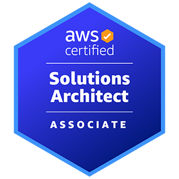

# AWS Certified Solutions Architect - Associate (SAA-C03)

## Information

Source: https://d1.awsstatic.com/training-and-certification/docs-sa-assoc/AWS-Certified-Solutions-Architect-Associate_Exam-Guide.pdf

## Overview

The exam has the following content domains and weightings:
 * Domain 1: Design Secure Architectures (30% of scored content)
 * Domain 2: Design Resilient Architectures (26% of scored content)
 * Domain 3: Design High-Performing Architectures (24% of scored content)
 * Domain 4: Design Cost-Optimized Architectures (20% of scored content)

## Domain 1: Design Secure Architectures

### Task Statement 1.1: Design secure access to AWS resources

Knowledge of:

- Access controls and management across multiple accounts
- AWS federated access and identity services (for example, AWS Identity and
Access Management [IAM], AWS IAM Identity Center [AWS Single Sign-On])
- AWS global infrastructure (for example, Availability Zones, AWS Regions)
- AWS security best practices (for example, the principle of least privilege)
- The AWS shared responsibility model

Skills in:

- Applying AWS security best practices to IAM users and root users (for
example, multi-factor authentication [MFA])
- Designing a flexible authorization model that includes IAM users, groups,
roles, and policies
- Designing a role-based access control strategy (for example, AWS Security
Token Service [AWS STS], role switching, cross-account access)
- Designing a security strategy for multiple AWS accounts (for example, AWS
Control Tower, service control policies [SCPs])
- Determining the appropriate use of resource policies for AWS services
- Determining when to federate a directory service with IAM roles
Task Statement

### Task Statement 1.2: Design secure workloads and applications

Knowledge of:

- Application configuration and credentials security
- AWS service endpoints
- Control ports, protocols, and network traffic on AWS
- Secure application access
Security services with appropriate use cases (for example, Amazon Cognito,
Amazon GuardDuty, Amazon Macie)
- Threat vectors external to AWS (for example, DDoS, SQL injection)

Skills in:

- Designing VPC architectures with security components (for example,
security groups, route tables, network ACLs, NAT gateways)
- Determining network segmentation strategies (for example, using public
subnets and private subnets)
- Integrating AWS services to secure applications (for example, AWS Shield,
AWS WAF, IAM Identity Center, AWS Secrets Manager)
- Securing external network connections to and from the AWS Cloud (for
example, VPN, AWS Direct Connect)

### Task Statement 1.3: Determine appropriate data security controls.

Knowledge of:

- Data access and governance
- Data recovery
- Data retention and classification
- Encryption and appropriate key management

Skills in:

- Aligning AWS technologies to meet compliance requirements
- Encrypting data at rest (for example, AWS Key Management Service [AWS
KMS])
- Encrypting data in transit (for example, AWS Certificate Manager [ACM]
using TLS)
- Implementing access policies for encryption keys
- Implementing data backups and replications
- Implementing policies for data access, lifecycle, and protection
- Rotating encryption keys and renewing certificates

## Domain 2: Design Resilient Architectures

### Task Statement 2.1: Design scalable and loosely coupled architectures.

Knowledge of:

- API creation and management (for example, Amazon API Gateway, REST
API)
- AWS managed services with appropriate use cases (for example, AWS
Transfer Family, Amazon Simple Queue Service [Amazon SQS], Secrets
Manager)
- Caching strategies
- Design principles for microservices (for example, stateless workloads
compared with stateful workloads)
- Event-driven architectures
- Horizontal scaling and vertical scaling
- How to appropriately use edge accelerators (for example, content delivery
network [CDN])
- How to migrate applications into containers
- Load balancing concepts (for example, Application Load Balancer)
- Multi-tier architectures
- Queuing and messaging concepts (for example, publish/subscribe)
- Serverless technologies and patterns (for example, AWS Fargate, AWS
Lambda)
- Storage types with associated characteristics (for example, object, file,
block)
- The orchestration of containers (for example, Amazon Elastic Container
Service [Amazon ECS], Amazon Elastic Kubernetes Service [Amazon EKS])
- When to use read replicas
- Workflow orchestration (for example, AWS Step Functions)

Skills in:

- Designing event-driven, microservice, and/or multi-tier architectures based
on requirements
- Determining scaling strategies for components used in an architecture
design
- Determining the AWS services required to achieve loose coupling based on
requirements
- Determining when to use containers
- Determining when to use serverless technologies and patterns
- Recommending appropriate compute, storage, networking, and database
technologies based on requirements
- Using purpose-built AWS services for workloads

### Task Statement 2.2: Design highly available and/or fault-tolerant architectures.

Knowledge of:

- AWS global infrastructure (for example, Availability Zones, AWS Regions,
Amazon Route 53)
- AWS managed services with appropriate use cases (for example, Amazon
Comprehend, Amazon Polly)
- Basic networking concepts (for example, route tables)
- Disaster recovery (DR) strategies (for example, backup and restore, pilot
light, warm standby, active-active failover, recovery point objective [RPO],
recovery time objective [RTO])
- Distributed design patterns
- Failover strategies
- Immutable infrastructure
- Load balancing concepts (for example, Application Load Balancer)
- Proxy concepts (for example, Amazon RDS Proxy)
- Service quotas and throttling (for example, how to configure the service
quotas for a workload in a standby environment)
- Storage options and characteristics (for example, durability, replication)
- Workload visibility (for example, AWS X-Ray)

Skills in:

- Determining automation strategies to ensure infrastructure integrity
- Determining the AWS services required to provide a highly available and/or
fault-tolerant architecture across AWS Regions or Availability Zones
- Identifying metrics based on business requirements to deliver a highly
available solution
- Implementing designs to mitigate single points of failure
- Implementing strategies to ensure the durability and availability of data
(for example, backups)
Selecting an appropriate DR strategy to meet business requirements
- Using AWS services that improve the reliability of legacy applications and
applications not built for the cloud (for example, when application changes
are not possible)
- Using purpose-built AWS services for workloads

## Domain 3: Design High-Performing Architectures

### Task Statement 3.1: Determine high-performing and/or scalable storage solutions.

Knowledge of:

- Hybrid storage solutions to meet business requirements
- Storage services with appropriate use cases (for example, Amazon S3,
Amazon Elastic File System [Amazon EFS], Amazon Elastic Block Store
[Amazon EBS])
- Storage types with associated characteristics (for example, object, file,
block)

Skills in:

- Determining storage services and configurations that meet performance
demands
- Determining storage services that can scale to accommodate future needs

### Task Statement 3.2: Design high-performing and elastic compute solutions.

Knowledge of:

- AWS compute services with appropriate use cases (for example, AWS Batch,
Amazon EMR, Fargate)
- Distributed computing concepts supported by AWS global infrastructure
and edge services
- Queuing and messaging concepts (for example, publish/subscribe)
- Scalability capabilities with appropriate use cases (for example, Amazon
EC2 Auto Scaling, AWS Auto Scaling)
- Serverless technologies and patterns (for example, Lambda, Fargate)
- The orchestration of containers (for example, Amazon ECS, Amazon EKS)

Skills in:

- Decoupling workloads so that components can scale independently
- Identifying metrics and conditions to perform scaling actions
- Selecting the appropriate compute options and features (for example, EC2
instance types) to meet business requirements
- Selecting the appropriate resource type and size (for example, the amount
of Lambda memory) to meet business requirements

### Task Statement 3.3: Determine high-performing database solutions.

Knowledge of:

- AWS global infrastructure (for example, Availability Zones, AWS Regions)
- Caching strategies and services (for example, Amazon ElastiCache)
- Data access patterns (for example, read-intensive compared with write-
intensive)
- Database capacity planning (for example, capacity units, instance types,
Provisioned IOPS)
- Database connections and proxies
- Database engines with appropriate use cases (for example, heterogeneous
migrations, homogeneous migrations)
- Database replication (for example, read replicas)
- Database types and services (for example, serverless, relational compared
with non-relational, in-memory)

Skills in:

- Configuring read replicas to meet business requirements
- Designing database architectures
- Determining an appropriate database engine (for example, MySQL
compared with PostgreSQL)
- Determining an appropriate database type (for example, Amazon Aurora,
Amazon DynamoDB)
- Integrating caching to meet business requirements

### Task Statement 3.4: Determine high-performing and/or scalable network
architectures.

Knowledge of:

- Edge networking services with appropriate use cases (for example, Amazon
CloudFront, AWS Global Accelerator)
- How to design network architecture (for example, subnet tiers, routing, IP
addressing)
- Load balancing concepts (for example, Application Load Balancer)
- Network connection options (for example, AWS VPN, Direct Connect, AWS
PrivateLink)

Skills in:

- Creating a network topology for various architectures (for example, global,
hybrid, multi-tier)
- Determining network configurations that can scale to accommodate future
needs
- Determining the appropriate placement of resources to meet business
requirements
- Selecting the appropriate load-balancing strategy

### Task Statement 3.5: Determine high-performing data ingestion and transformation solutions.

Knowledge of:

- Data analytics and visualization services with appropriate use cases (for
example, Amazon Athena, AWS Lake Formation, Amazon QuickSight)
- Data ingestion patterns (for example, frequency)
- Data transfer services with appropriate use cases (for example, AWS
DataSync, AWS Storage Gateway)
- Data transformation services with appropriate use cases (for example, AWS
Glue)
- Secure access to ingestion access points
- Sizes and speeds needed to meet business requirements
- Streaming data services with appropriate use cases (for example, Amazon
Kinesis)

Skills in:

- Building and securing data lakes
- Designing data streaming architectures
- Designing data transfer solutions
- Implementing visualization strategies
- Selecting appropriate compute options for data processing (for example,
Amazon EMR)
- Selecting appropriate configurations for ingestion
- Transforming data between formats (for example, .csv to .parquet)

## Domain 4: Design Cost-Optimized Architectures

### Task Statement 4.1: Design cost-optimized storage solutions.

Knowledge of:

- Access options (for example, an S3 bucket with Requester Pays object
storage)
- AWS cost management service features (for example, cost allocation tags,
multi-account billing)
- AWS cost management tools with appropriate use cases (for example, AWS
Cost Explorer, AWS Budgets, AWS Cost and Usage Report)
- AWS storage services with appropriate use cases (for example, Amazon FSx,
Amazon EFS, Amazon S3, Amazon EBS)
- Backup strategies
- Block storage options (for example, hard disk drive [HDD] volume types,
solid state drive [SSD] volume types)
- Data lifecycles
- Hybrid storage options (for example, DataSync, Transfer Family, Storage
Gateway)
- Storage access patterns
- Storage tiering (for example, cold tiering for object storage)
- Storage types with associated characteristics (for example, object, file,
block)

Skills in:

- Designing appropriate storage strategies (for example, batch uploads to
Amazon S3 compared with individual uploads)
- Determining the correct storage size for a workload
- Determining the lowest cost method of transferring data for a workload to
AWS storage
- Determining when storage auto scaling is required
- Managing S3 object lifecycles
- Selecting the appropriate backup and/or archival solution
- Selecting the appropriate service for data migration to storage services
- Selecting the appropriate storage tier
- Selecting the correct data lifecycle for storage
- Selecting the most cost-effective storage service for a workload

### Task Statement 4.2: Design cost-optimized compute solutions.

Knowledge of:

- AWS cost management service features (for example, cost allocation tags,
multi-account billing)
- AWS cost management tools with appropriate use cases (for example, Cost
Explorer, AWS Budgets, AWS Cost and Usage Report)
- AWS global infrastructure (for example, Availability Zones, AWS Regions)
- AWS purchasing options (for example, Spot Instances, Reserved Instances,
Savings Plans)
- Distributed compute strategies (for example, edge processing)
- Hybrid compute options (for example, AWS Outposts, AWS Snowball Edge)
Instance types, families, and sizes (for example, memory optimized,
compute optimized, virtualization)
- Optimization of compute utilization (for example, containers, serverless
computing, microservices)
- Scaling strategies (for example, auto scaling, hibernation)

Skills in:

- Determining an appropriate load balancing strategy (for example,
Application Load Balancer [Layer 7] compared with Network Load Balancer
[Layer 4] compared with Gateway Load Balancer)
- Determining appropriate scaling methods and strategies for elastic
workloads (for example, horizontal compared with vertical, EC2
hibernation)
- Determining cost-effective AWS compute services with appropriate use
cases (for example, Lambda, Amazon EC2, Fargate)
- Determining the required availability for different classes of workloads (for
example, production workloads, non-production workloads)
- Selecting the appropriate instance family for a workload
- Selecting the appropriate instance size for a workload

### Task Statement 4.3: Design cost-optimized database solutions.

Knowledge of:

- AWS cost management service features (for example, cost allocation tags,
multi-account billing)
- AWS cost management tools with appropriate use cases (for example, Cost
Explorer, AWS Budgets, AWS Cost and Usage Report)
- Caching strategies
- Data retention policies
- Database capacity planning (for example, capacity units)
- Database connections and proxies
- Database engines with appropriate use cases (for example, heterogeneous
migrations, homogeneous migrations)
- Database replication (for example, read replicas)
- Database types and services (for example, relational compared with non-
relational, Aurora, DynamoDB)

Skills in:

- Designing appropriate backup and retention policies (for example, snapshot
frequency)
- Determining an appropriate database engine (for example, MySQL
compared with PostgreSQL)
- Determining cost-effective AWS database services with appropriate use
cases (for example, DynamoDB compared with Amazon RDS, serverless)
- Determining cost-effective AWS database types (for example, time series
format, columnar format)
- Migrating database schemas and data to different locations and/or
different database engines

### Task Statement 4.4: Design cost-optimized network architectures.

Knowledge of:

- AWS cost management service features (for example, cost allocation tags,
multi-account billing)
- AWS cost management tools with appropriate use cases (for example, Cost
Explorer, AWS Budgets, AWS Cost and Usage Report)
- Load balancing concepts (for example, Application Load Balancer)
- NAT gateways (for example, NAT instance costs compared with NAT
gateway costs)
- Network connectivity (for example, private lines, dedicated lines, VPNs)
- Network routing, topology, and peering (for example, AWS Transit Gateway,
VPC peering)
- Network services with appropriate use cases (for example, DNS)

Skills in:

- Configuring appropriate NAT gateway types for a network (for example, a
single shared NAT gateway compared with NAT gateways for each
Availability Zone)
- Configuring appropriate network connections (for example, Direct Connect
compared with VPN compared with internet)
- Configuring appropriate network routes to minimize network transfer costs
(for example, Region to Region, Availability Zone to Availability Zone,
private to public, Global Accelerator, VPC endpoints)
- Determining strategic needs for content delivery networks (CDNs) and edge
caching
- Reviewing existing workloads for network optimizations
- Selecting an appropriate throttling strategy
- Selecting the appropriate bandwidth allocation for a network device (for
example, a single VPN compared with multiple VPNs, Direct Connect speed)