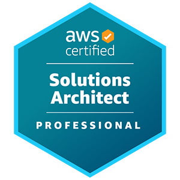

# AWS Certified Solutions Architect - Professional (SAP-C02) 



## Information

* [AWS Certified Solutions Architect - Professional](https://aws.amazon.com/certification/certified-solutions-architect-professional/)
* [Exam Guide: AWS Certified Solutions Architect - Professional(SAP-C02)](https://d1.awsstatic.com/training-and-certification/docs-sa-pro/AWS-Certified-Solutions-Architect-Professional_Exam-Guide.pdf)

## Overview

* Domain 1: Design Solutions for Organizational Complexity (26% of scored
content)
* Domain 2: Design for New Solutions (29% of scored content)
* Domain 3: Continuous Improvement for Existing Solutions (25% of scored
content)
* Domain 4: Accelerate Workload Migration and Modernization (20% of scored
content)

## Contents 

### ****Domain 1: Design Solutions for Organizational Complexity****

#### **Task Statement 1.1: Architect network connectivity strategies.**

```
Knowledge of:
```
- AWS Global Infrastructure
- AWS networking concepts (for example, Amazon VPC, AWS Direct Connect,
    AWS VPN, transitive routing, AWS container services)
- Hybrid DNS concepts (for example, Amazon Route 53 Resolver, on-premises
    DNS integration)
- Network segmentation (for example, subnetting, IP addressing, connectivity
    among VPCs)
- Network traffic monitoring


```
Skills in:
```
- Evaluating connectivity options for multiple VPCs
- Evaluating connectivity options for on-premises, co-location, and cloud
    integration
- Selecting AWS Regions and Availability Zones based on network and
    latency requirements
- Troubleshooting traffic flows by using AWS tools
- Using service endpoints for service integrations

#### **Task Statement 1.2: Prescribe security controls.**

```
Knowledge of:
```
- AWS Identity and Access Management (IAM) and AWS IAM Identity Center
    (AWS Single Sign-On)
- Route tables, security groups, and network ACLs
- Encryption keys and certificate management (for example, AWS Key
    Management Service [AWS KMS], AWS Certificate Manager [ACM])
- AWS security, identity, and compliance tools (for example, AWS CloudTrail,
    AWS Identity and Access Management Access Analyzer, AWS Security Hub,
    Amazon Inspector)

```
Skills in:
```
- Evaluating cross-account access management
- Integrating with third-party identity providers
- Deploying encryption strategies for data at rest and data in transit
- Developing a strategy for centralized security event notifications and
    auditing

#### **Task Statement 1.3: Design reliable and resilient architectures.**

```
Knowledge of:
```
- Recovery time objectives (RTOs) and recovery point objectives (RPOs)
- Disaster recovery strategies (for example, using AWS Elastic Disaster
    Recovery, pilot light, warm standby, and multi-site)
- Data backup and restoration


```
Skills in:
```
- Designing disaster recovery solutions based on RTO and RPO requirements
- Implementing architectures to automatically recover from failure
- Developing the optimal architecture by considering scale-up and scale-out
    options
- Designing an effective backup and restoration strategy

#### **Task Statement 1. 4 : Design a multi-account AWS environment.**

```
Knowledge of:
```
- AWS Organizations and AWS Control Tower
- Multi-account event notifications
- AWS resource sharing across environments

```
Skills in:
```
- Evaluating the most appropriate account structure for organizational
    requirements
- Recommending a strategy for central logging and event notifications
- Developing a multi-account governance model

#### **Task Statement 1. 5 : Determine cost optimization and visibility strategies.**

```
Knowledge of:
```
- AWS cost and usage monitoring tools (for example, AWS Trusted Advisor,
    AWS Pricing Calculator, AWS Cost Explorer, AWS Budgets)
- AWS purchasing options (for example, Reserved Instances, Savings Plans,
    Spot Instances)
- AWS rightsizing visibility tools (for example, AWS Compute Optimizer,
    Amazon S3 Storage Lens)

```
Skills in:
```
- Monitoring cost and usage with AWS tools
- Developing an effective tagging strategy that maps costs to business units
- Understanding how purchasing options affect cost and performance


### ****Domain 2 : Design for New Solutions****

#### **Task Statement 2.1: Design a deployment strategy to meet business requirements.**

```
Knowledge of:
```
- Infrastructure as code (IaC) (for example, AWS CloudFormation)
- Continuous integration and continuous delivery (CI/CD)
- Change management processes
- Configuration management tools (for example, AWS Systems Manager)
Skills in:
- Determining an application or upgrade path for new services and features
- Selecting services to develop deployment strategies and implement
appropriate rollback mechanisms
- Adopting managed services as needed to reduce infrastructure provisioning
and patching overhead
- Making advanced technologies accessible by delegating complex
development and deployment tasks to AWS

#### **Task Statement 2.2: Design a solution to ensure business continuity.**

```
Knowledge of:
```
- AWS Global Infrastructure
- AWS networking concepts (for example, Route 53, routing methods)
- RTOs and RPOs
- Disaster recovery scenarios (for example, backup and restore, pilot light,
    warm standby, multi-site)
- Disaster recovery solutions on AWS
Skills in:
- Configuring disaster recovery solutions
- Configuring data and database replication
- Performing disaster recovery testing
- Architecting a backup solution that is automated, is cost-effective, and
supports business continuity across multiple Availability Zones or Regions
- Designing an architecture that provides application and infrastructure
availability in the event of a disruption
- Using processes and components for centralized monitoring to proactively
recover from system failures


#### **Task Statement 2.3: Determine security controls based on requirements.**

```
Knowledge of:
```
- IAM
- Route tables, security groups, and network ACLs
- Encryption options for data at rest and data in transit
- AWS service endpoints
- Credential management services
- AWS managed security services (for example, AWS Shield, AWS WAF,
    Amazon GuardDuty, AWS Security Hub)

```
Skills in:
```
- Specifying IAM users and IAM roles that adhere to the principle of least
    privilege access
- Specifying inbound and outbound network flows by using security group
    rules and network ACL rules
- Developing attack mitigation strategies for large-scale web applications
- Developing encryption strategies for data at rest and data in transit
- Specifying service endpoints for service integrations
- Developing strategies for patch management to remain compliant with
    organizational standards

#### **Task Statement 2. 4 : Design a strategy to meet reliability requirements.**

```
Knowledge of:
```
- AWS Global Infrastructure
- AWS storage services and replication strategies (for example Amazon S3,
    Amazon RDS, Amazon ElastiCache)
- Multi-AZ and multi-Region architectures
- Auto scaling policies and events
- Application integration (for example, Amazon Simple Notification Service
    [Amazon SNS], Amazon Simple Queue Service [Amazon SQS], AWS Step
    Functions)
- Service quotas and limits


```
Skills in:
```
- Designing highly available application environments based on business
    requirements
- Using advanced techniques to design for failure and ensure seamless
    system recoverability
- Implementing loosely coupled dependencies
- Operating and maintaining high-availability architectures (for example,
    application failovers, database failovers)
- Using AWS managed services for high availability
- Implementing DNS routing policies (for example, Route 53 latency-based
    routing, geolocation routing, simple routing)

#### **Task Statement 2. 5 : Design a solution to meet performance objectives.**

```
Knowledge of:
```
- Performance monitoring technologies
- Storage options on AWS
- Instance families and use cases
- Purpose-built databases

```
Skills in:
```
- Designing large-scale application architectures for a variety of access
    patterns
- Designing an elastic architecture based on business objectives
- Applying design patterns to meet performance objectives with caching,
    buffering, and replicas
- Developing a process methodology for selecting purpose-built services for
    required tasks
- Designing a rightsizing strategy


#### **Task Statement 2. 6 : Determine a cost optimization strategy to meet solution goals**
and objectives.

```
Knowledge of:
```
- AWS cost and usage monitoring tools (for example, Cost Explorer, Trusted
    Advisor, AWS Pricing Calculator)
- Pricing models (for example, Reserved Instances, Savings Plans)
- Storage tiering
- Data transfer costs
- AWS managed service offerings

```
Skills in:
```
- Identifying opportunities to select and rightsize infrastructure for
    cost-effective resources
- Identifying appropriate pricing models
- Performing data transfer modeling and selecting services to reduce data
    transfer costs
- Developing a strategy and implementing controls for expenditure and
    usage awareness

### ****Domain 3: Continuous Improvement for Existing Solutions****

#### **Task Statement 3.1: Determine a strategy to improve overall operational excellence.**

```
Knowledge of:
```
- Alerting and automatic remediation strategies
- Disaster recovery planning
- Monitoring and logging solutions (for example, Amazon CloudWatch)
- CI/CD pipelines and deployment strategies (for example, blue/green,
    all-at-once, rolling)
- Configuration management tools (for example, Systems Manager)


```
Skills in:
```
- Determining the most appropriate logging and monitoring strategy
- Evaluating current deployment processes for improvement opportunities
- Prioritizing opportunities for automation within a solution stack
- Recommending the appropriate AWS solution to enable configuration
    management automation
- Engineering failure scenario activities to support and exercise an
    understanding of recovery actions

#### **Task Statement 3.2: Determine a strategy to improve security.**

```
Knowledge of:
```
- Data retention, data sensitivity, and data regulatory requirements
- Automated monitoring and remediation strategies (for example, AWS
    Config rules)
- Secrets management (for example, Systems Manager, AWS Secrets
    Manager)
- Principle of least privilege access
- Security-specific AWS solutions
- Patching practices
- Backup practices and methods

```
Skills in:
```
- Evaluating a strategy for the secure management of secrets and credentials
- Auditing an environment for least privilege access
- Reviewing implemented solutions to ensure security at every layer
- Reviewing comprehensive traceability of users and services
- Prioritizing automated responses to the detection of vulnerabilities
- Designing and implementing a patch and update process
- Designing and implementing a backup process
- Employing remediation techniques


#### **Task Statement 3.3: Determine a strategy to improve performance.**

```
Knowledge of:
```
- High-performing systems architectures (for example, auto scaling, instance
    fleets, placement groups)
- Global service offerings (for example, AWS Global Accelerator, Amazon
    CloudFront, edge computing services)
- Monitoring tool sets and services (for example, CloudWatch)
- Service level agreements (SLAs) and key performance indicators (KPIs)

```
Skills in:
```
- Translating business requirements to measurable metrics
- Testing potential remediation solutions and making recommendations
- Proposing opportunities for the adoption of new technologies and
    managed services
- Assessing solutions and applying rightsizing based on requirements
- Identifying and examining performance bottlenecks

#### **Task Statement 3. 4 : Determine a strategy to improve reliability.**

```
Knowledge of:
```
- AWS Global Infrastructure
- Data replication methods
- Scaling methodologies (for example, load balancing, auto scaling)
- High availability and resiliency
- Disaster recovery methods and tools
- Service quotas and limits

```
Skills in:
```
- Understanding application growth and usage trends
- Evaluating existing architecture to determine areas that are not sufficiently
    reliable
- Remediating single points of failure
- Enabling data replication, self-healing, and elastic features and services


#### **Task Statement 3.5: Identify opportunities for cost optimizations.**

```
Knowledge of:
```
- Cost-conscious architecture choices (for example, using Spot Instances,
    scaling policies, and rightsizing resources)
- Price model adoptions (for example, Reserved Instances, Savings Plans)
- Networking and data transfer costs
- Cost management, alerting, and reporting

```
Skills in:
```
- Analyzing usage reports to identify underutilized and overutilized resources
- Using AWS solutions to identify unused resources
- Designing billing alarms based on expected usage patterns
- Investigating AWS Cost and Usage Reports at a granular level
- Using tagging for cost allocation and reporting

### ****Domain 4: Accelerate Workload Migration and Modernization****

#### **Task Statement 4.1: Select existing workloads and processes for potential migration.**

```
Knowledge of:
```
- Migration assessment and tracking tools (for example, AWS Migration Hub)
- Portfolio assessment
- Asset planning
- Prioritization and migration of workloads (for example, wave planning)

```
Skills in:
```
- Completing an application migration assessment
- Evaluating applications according to the seven common migration
    strategies (7Rs)
- Evaluating total cost of ownership (TCO)


#### **Task Statement 4.2: Determine the optimal migration approach for existing**
workloads.

```
Knowledge of:
```
- Data migration options and tools (for example, AWS DataSync, AWS
    Transfer Family, AWS Snow Family, S3 Transfer Acceleration)
- Application migration tools (for example, AWS Application Discovery
    Service, AWS Application Migration Service)
- AWS networking services and DNS (for example, Direct Connect, AWS
    Site-to-Site VPN, Route 53)
- Identity services (for example, IAM Identity Center, AWS Directory Service)
- Database migration tools (for example, AWS Database Migration Service
    [AWS DMS], AWS Schema Conversion Tool [AWS SCT])
- Governance tools (for example, AWS Control Tower, Organizations)

```
Skills in:
```
- Selecting the appropriate database transfer mechanism
- Selecting the appropriate application transfer mechanism
- Selecting the appropriate data transfer service and migration strategy
- Applying the appropriate security methods to migration tools
- Selecting the appropriate governance model

#### **Task Statement 4.3: Determine a new architecture for existing workloads.**

```
Knowledge of:
```
- Compute services (for example, Amazon EC2, AWS Elastic Beanstalk)
- Containers (for example, Amazon Elastic Container Service [Amazon ECS],
    Amazon Elastic Kubernetes Service [Amazon EKS], AWS Fargate, Amazon
    Elastic Container Registry [Amazon ECR])
- AWS storage services (for example, Amazon Elastic Block Store [Amazon
    EBS], Amazon Elastic File System [Amazon EFS], Amazon FSx, Amazon S3,
    Volume Gateway)
- Databases (for example, Amazon DynamoDB, Amazon OpenSearch Service,
    Amazon RDS, self-managed databases on Amazon EC2)


```
Skills in:
```
- Selecting the appropriate compute platform
- Selecting the appropriate container hosting platform
- Selecting the appropriate storage service
- Selecting the appropriate database platform

#### **Task Statement 4. 4 : Determine opportunities for modernization and enhancements.**

```
Knowledge of:
```
- Serverless compute offerings (for example, AWS Lambda)
- Containers (for example, Amazon ECS, Amazon EKS, Fargate)
- AWS storage services (for example, Amazon S3, Amazon EFS)
- Purpose-built databases (for example, DynamoDB, Amazon Aurora
    Serverless, ElastiCache)
- Integration services (for example, Amazon SQS, Amazon SNS, Amazon
    EventBridge, Step Functions)

```
Skills in:
```
- Identifying opportunities to decouple application components
- Identifying opportunities for serverless solutions
- Selecting the appropriate service for containers
- Identifying opportunities for purpose-built databases
- Selecting the appropriate application integration service