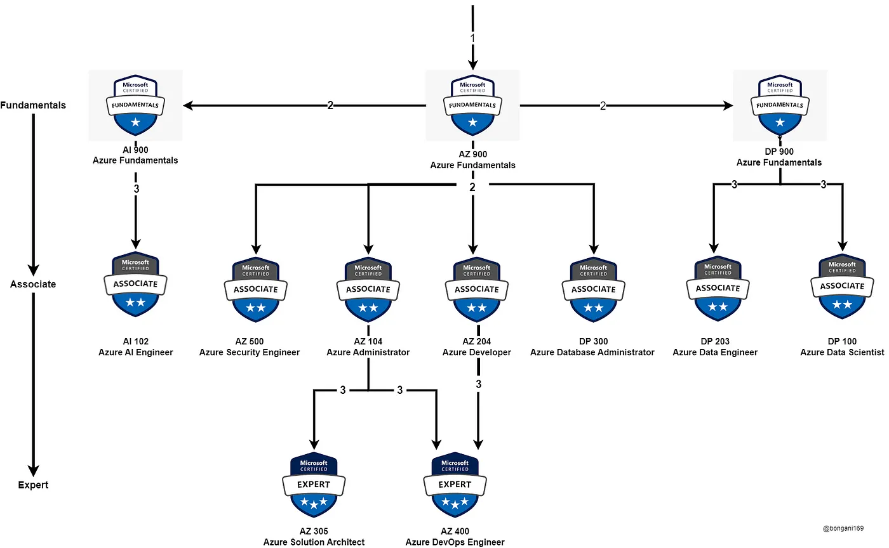

# Azure

## Overview

### Funadamentals

* [Azure Fundamentals](fundamentals.md) (AZ-900) - $99

### Associate

* [Azure Administrator](administrator.md) (AZ-104)- $165
  * [Microsoft Certified: Azure Administrator Associate](https://learn.microsoft.com/en-us/credentials/certifications/azure-administrator/)
  * [Study guide for Exam AZ-104: Microsoft Azure Administrator](https://learn.microsoft.com/en-us/credentials/certifications/resources/study-guides/az-104)

### Expert

* [Azure Solutions Architect](solutions_architect.md) (AZ-305)- $165
  * [Exam AZ-305: Designing Microsoft Azure Infrastructure Solutions](https://learn.microsoft.com/en-us/credentials/certifications/exams/az-305/)
  * [Microsoft Certified: Azure Solutions Architect Expert](https://learn.microsoft.com/en-us/credentials/certifications/azure-solutions-architect/)

## External Sources (non-Microsoft)

* [Azure Administrator Certification (AZ-104) – Pass the Exam With This Free 11-Hour Course](https://www.freecodecamp.org/news/azure-administrator-certification-az-104-pass-the-exam-with-this-free-11-hour-course/)
* [Guide to the Microsoft Azure Certification Roadmap](https://medium.com/@bongani169/guide-to-the-microsoft-azure-certification-roadmap-54979f1db5c1)
* [Microsoft Azure Certification Path Guide](https://www.theknowledgeacademy.com/blog/microsoft-azure-certification-path/)
* [Microsoft Azure Certification Path: A Step-by-Step 2024 Guide](https://k21academy.com/microsoft-azure/certification-path/)