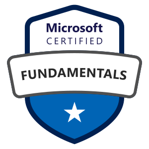

# Microsoft Azure Administrator

## Information

* [Study guide for Exam AZ-900: Microsoft Azure Fundamentals](https://learn.microsoft.com/en-us/credentials/certifications/resources/study-guides/az-900)

## Content 

### **Describe cloud concepts** (25–30%)

#### **Describe cloud computing**

* Define cloud computing
* Describe the shared responsibility model
* Define cloud models, including public, private, and hybrid
* Identify appropriate use cases for each cloud model
* Describe the consumption-based model
* Compare cloud pricing models
* Describe serverless

#### **Describe the benefits of using cloud services**

* Describe the benefits of high availability and scalability in the cloud
* Describe the benefits of reliability and predictability in the cloud
* Describe the benefits of security and governance in the cloud
* Describe the benefits of manageability in the cloud

#### **Describe cloud service types**

* Describe infrastructure as a service (IaaS)
* Describe platform as a service (PaaS)
* Describe software as a service (SaaS)
* Identify appropriate use cases for each cloud service type (IaaS, PaaS, and SaaS)

### **Describe Azure architecture and services** (35–40%)

#### **Describe the core architectural components of Azure**

* Describe Azure regions, region pairs, and sovereign regions
* Describe availability zones
* Describe Azure datacenters
* Describe Azure resources and resource groups
* Describe subscriptions
* Describe management groups
* Describe the hierarchy of resource groups, subscriptions, and management groups

#### **Describe Azure compute and networking services**

* Compare compute types, including containers, virtual machines, and functions
* Describe virtual machine options, including Azure virtual machines, Azure Virtual Machine Scale Sets, availability sets, and Azure Virtual Desktop
* Describe the resources required for virtual machines
* Describe application hosting options, including web apps, containers, and virtual machines
* Describe virtual networking, including the purpose of Azure virtual networks, Azure virtual subnets, peering, Azure DNS, Azure VPN Gateway, and ExpressRoute
* Define public and private endpoints

#### **Describe Azure storage services**

* Compare Azure Storage services
* Describe storage tiers
* Describe redundancy options
* Describe storage account options and storage types
* Identify options for moving files, including AzCopy, Azure Storage Explorer, and Azure File Sync
* Describe migration options, including Azure Migrate and Azure Data Box

#### **Describe Azure identity, access, and security**

* Describe directory services in Azure, including Microsoft Entra ID and Microsoft Entra Domain Services
* Describe authentication methods in Azure, including single sign-on (SSO), multi-factor authentication (MFA), and passwordless
* Describe external identities in Azure, including business-to-business (B2B) and business-to-customer (B2C)
* Describe Microsoft Entra Conditional Access
* Describe Azure role-based access control (RBAC)
* Describe the concept of Zero Trust
* Describe the purpose of the defense-in-depth model
* Describe the purpose of Microsoft Defender for Cloud

### **Describe Azure management and governance** (30–35%)

#### **Describe cost management in Azure**

* Describe factors that can affect costs in Azure
* Compare the pricing calculator and the Total Cost of Ownership (TCO) Calculator
* Describe cost management capabilities in Azure
* Describe the purpose of tags

#### **Describe features and tools in Azure for governance and compliance**

* Describe the purpose of Microsoft Purview in Azure
* Describe the purpose of Azure Policy
* Describe the purpose of resource locks

#### **Describe features and tools for managing and deploying Azure resources**

* Describe the Azure portal
* Describe Azure Cloud Shell, including Azure Command-Line Interface (CLI) and Azure PowerShell
* Describe the purpose of Azure Arc
* Describe infrastructure as code (IaC)
* Describe Azure Resource Manager (ARM) and ARM templates

#### **Describe monitoring tools in Azure**

* Describe the purpose of Azure Advisor
* Describe Azure Service Health
* Describe Azure Monitor, including Log Analytics, Azure Monitor alerts, and Application Insights