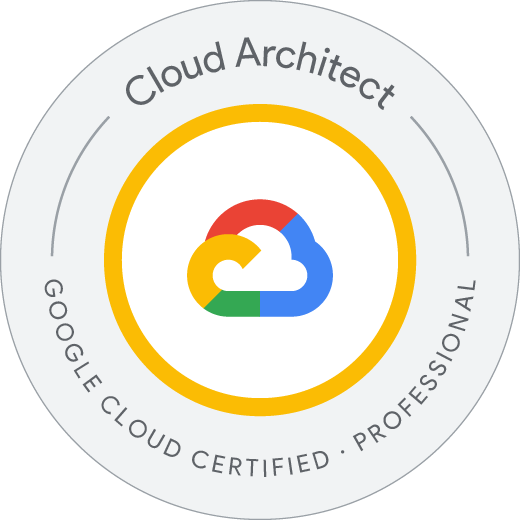

# Professional Cloud Architect

## Information

* [Professional Cloud Architect](https://cloud.google.com/learn/certification/cloud-architect)
* [Cloud Architect Learning Path](https://www.cloudskillsboost.google/paths/12)
* [Exam Guide for Professional Cloud Architect](https://cloud.google.com/learn/certification/guides/professional-cloud-architect)
* [Guide to Preparing for the Professional Cloud Architect Certification](https://www.googlecloudcommunity.com/gc/Community-Blogs/Guide-to-Preparing-for-the-Professional-Cloud-Architect/ba-p/496772)

## Contents

### **Section 1: Designing and planning a cloud solution architecture (~24% of the exam)**

#### **1.1 Designing a solution infrastructure that meets business requirements. Considerations include:**

* Business use cases and product strategy
* Cost optimization
* Supporting the application design
* Integration with external systems
* Movement of data
* Design decision trade-offs
* Build, buy, modify, or deprecate
* Success measurements (e.g., key performance indicators [KPI], return on investment [ROI], metrics)
* Compliance and observability

#### **1.2 Designing a solution infrastructure that meets technical requirements. Considerations include:**

* High availability and failover design
* Elasticity of cloud resources with respect to quotas and limits
* Scalability to meet growth requirements
* Performance and latency

#### **1.3 Designing network, storage, and compute resources. Considerations include:**

* Integration with on-premises/multicloud environments
* Cloud-native networking (VPC, peering, firewalls, container networking)
* Choosing data processing technologies
* Choosing appropriate storage types (e.g., object, file, databases)
* Choosing compute resources (e.g., preemptible, custom machine type, specialized workload)
* Mapping compute needs to platform products

#### **1.4 Creating a migration plan (i.e., documents and architectural diagrams). Considerations include:**

* Integrating solutions with existing systems
* Migrating systems and data to support the solution
* Software license mapping
* Network planning
* Testing and proofs of concept
* Dependency management planning

#### **1.5 Envisioning future solution improvements. Considerations include:**

* Cloud and technology improvements
* Evolution of business needs
* Evangelism and advocacy

### **Section 2: Managing and provisioning a solution infrastructure (~15% of the exam)**

#### **2.1 Configuring network topologies. Considerations include:**

* Extending to on-premises environments (hybrid networking)
* Extending to a multicloud environment that may include Google Cloud to Google Cloud communication
* Security protection (e.g. intrusion protection, access control, firewalls)

#### **2.2 Configuring individual storage systems. Considerations include:**

* Data storage allocation
* Data processing/compute provisioning
* Security and access management
* Network configuration for data transfer and latency
* Data retention and data life cycle management
* Data growth planning

#### **2.3 Configuring compute systems. Considerations include:**

* Compute resource provisioning
* Compute volatility configuration (preemptible vs. standard)
* Network configuration for compute resources (Google Compute Engine, Google Kubernetes Engine, serverless networking)
* Infrastructure orchestration, resource configuration, and patch management
* Container orchestration

### **Section 3: Designing for security and compliance (~18% of the exam)**

#### **3.1 Designing for security. Considerations include:**

* Identity and access management (IAM)
* Resource hierarchy (organizations, folders, projects)
* Data security (key management, encryption, secret management)
* Separation of duties (SoD)
* Security controls (e.g., auditing, VPC Service Controls, context aware access, organization policy)
* Managing customer-managed encryption keys with Cloud Key Management Service
* Remote access

#### **3.2 Designing for compliance. Considerations include:**

* Legislation (e.g., health record privacy, children’s privacy, data privacy, and ownership)
* Commercial (e.g., sensitive data such as credit card information handling, personally identifiable information [PII])
* Industry certifications (e.g., SOC 2)
* Audits (including logs)

### **Section 4: Analyzing and optimizing technical and business processes (~18% of the exam)**

#### **4.1 Analyzing and defining technical processes. Considerations include:**

* Software development life cycle (SDLC)
* Continuous integration / continuous deployment
* Troubleshooting / root cause analysis best practices
* Testing and validation of software and infrastructure
* Service catalog and provisioning
* Business continuity and disaster recovery

#### **4.2 Analyzing and defining business processes. Considerations include:**

* Stakeholder management (e.g. influencing and facilitation)
* Change management
* Team assessment / skills readiness
* Decision-making processes
* Customer success management
* Cost optimization / resource optimization (capex / opex)

#### **4.3 Developing procedures to ensure reliability of solutions in production (e.g., chaos engineering, penetration testing)**

### **Section 5: Managing implementation (~11% of the exam)**

#### **5.1 Advising development/operation teams to ensure successful deployment of the solution. Considerations include:**

* Application development
* API best practices
* Testing frameworks (load/unit/integration)
* Data and system migration and management tooling

#### **5.2 Interacting with Google Cloud programmatically. Considerations include:**

* Google Cloud Shell
* Google Cloud SDK (gcloud, gsutil and bq)
* Cloud Emulators (e.g. Cloud Bigtable, Datastore, Spanner, Pub/Sub, Firestore)

### **Section 6: Ensuring solution and operations reliability (~14% of the exam)**

#### **6.1 Monitoring/logging/profiling/alerting solution**

#### **6.2 Deployment and release management**

#### **6.3 Assisting with the support of deployed solutions**

#### **6.4 Evaluating quality control measures**