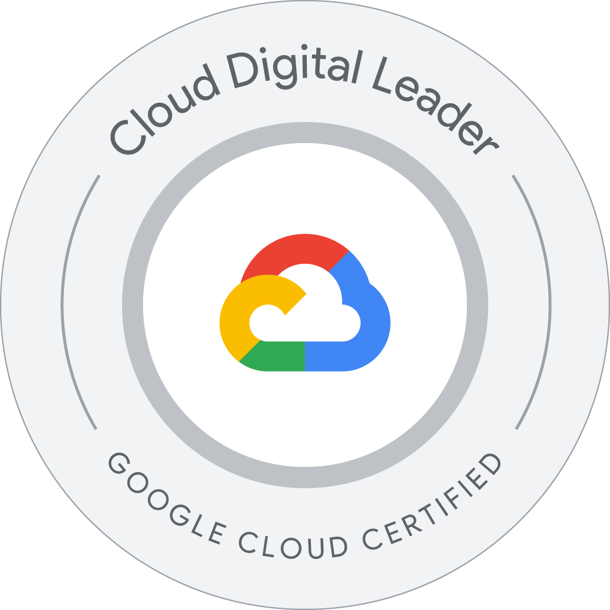

# Cloud Digital Leader 

## Information

* [Cloud Digital Leader](https://cloud.google.com/learn/certification/cloud-digital-leader)
* [Certification exam guide: Cloud Digital Leader](https://cloud.google.com/learn/certification/guides/cloud-digital-leader)

## Contents

### **Section 1: Digital Transformation with Google Cloud (~17% of the exam)**

#### **1.1 Why Cloud Technology is Transforming Business**

* **Explain why and how the cloud is revolutionizing businesses.**
  * Define the terms: cloud, cloud technology, data, digital transformation, cloud-native, open source, open standard.
  * Describe the differences between cloud technology and traditional or on-premises technology.
  * Explain the benefits of cloud technology to a business’ digital transformation: this technology is scalable, flexible, agile, secure, cost-effective and offers strategic value.
  * Describe the primary benefits of on-premises infrastructure, public cloud, private cloud, hybrid cloud, and multicloud and differentiate between them.
  * Describe the main business transformation benefits of Google Cloud: intelligence, freedom, collaboration, trust, and sustainability.
  * Describe the implications and risks for organizations that do not adopt new technology.
  * Describe the drivers and challenges that lead organizations to undergo a digital transformation.
  * Describe the transformation cloud and how it accelerates an organization’s digital transformation through app and infrastructure modernization, data democratization, people connections, and trusted transactions.

#### **1.2 Fundamental Cloud Concepts**

* **Explain general cloud concepts.**
  * Describe how transitioning to a cloud infrastructure affects flexibility, scalability, reliability, elasticity, agility, and total cost of ownership (TCO). Apply these concepts to various business use cases.
  * Explain how an organization’s transition from an on-premises environment to the cloud shifts their capital expenditures (CapEx) to operational expenditures (OpEx), and how that affects their total cost of ownership (TCO).
  * Identify when private, hybrid, or multicloud infrastructures best apply to different business use cases.
  * Define basic network infrastructure terminology, including: IP address; internet service provider (ISP); domain name server (DNS), regions, and zones; fiber optics; subsea cables; network edge data centers, latency; and bandwidth.
  * Discuss how Google Cloud supports digital transformation with global infrastructure and data centers connected by a fast, reliable network.

#### **1.3 Cloud Computing Models and Shared Responsibility**

* **Discuss the benefits and tradeoffs of using infrastructure as a service (IaaS); platform as a service (PaaS); and software as a service (SaaS).**
  * Define IaaS, PaaS, and SaaS.
  * Compare and contrast the benefits and tradeoffs of IaaS, PaaS, and SaaS including total cost of ownership (TCO), flexibility, shared responsibilities, management level, and necessary staffing and technical expertise.
  * Determine which computing model (IaaS, PaaS, SaaS) applies to various business scenarios and use cases.
  * Describe the cloud shared responsibility model. Compare which responsibilities are the cloud provider’s, and which responsibilities are the customer’s for on-premises and cloud computing models (IaaS, PaaS, SaaS).

### **Section 2: Exploring Data Transformation with Google Cloud (~16% of the exam)**

#### **2.1 The Value of Data**

* **Describe the intrinsic role that data plays in an organizations’ digital transformation.**
  * Explain how data generates business insights, drives decision making, and creates new value.
  * Differentiate between basic data management concepts, in particular: databases; data warehouses; data lakes.
  * Explain how organizations can create value by using their current data, collecting new data, and sourcing data externally.
  * Describe how the cloud unlocks business value from all types of data, including structured data and previously untapped unstructured data.
  * Discuss the main data value chain concepts and terms.
  * Explain how data governance is essential to a successful data journey.
#### **2.2 Google Cloud Data Management Solutions**

* **Determine which Google Cloud data management products are applicable to different business use cases.**
  * Differentiate between Google Cloud data management options including data type and common business use case, including: Cloud Storage; Cloud Spanner; Cloud SQL; Cloud Bigtable; BigQuery; Firestore.
  * Define key data management concepts and terms, including: relational; non-relational; object storage; structured query language (SQL); NoSQL.
  * Describe the benefits of using BigQuery as a serverless, managed data warehouse and analytics engine that can be used in a multicloud environment.
  * Differentiate between storage classes in Cloud Storage regarding cost and frequency of access, including: Standard; Nearline; Coldline; Archive.
  * Describe the ways that an organization can migrate or modernize their current database in the cloud.
#### **2.3 Making Data Useful and Accessible**

* **Discuss how smart analytics, business intelligence tools, and streaming analytics can add value in different business use cases.**
  * Describe how Looker democratizes access to data by empowering individuals to self-serve business intelligence and create insights.
  * Discuss the value of analyzing and visualizing data from BigQuery in Looker to create real-time reports, dashboards, and integrating data into workflows.
  * Describe how streaming analytics in real time makes data more useful and generates business value.
  * Describe the main Google Cloud products that modernize data pipelines, including Pub/Sub and Dataflow.
### **Section 3: Innovating with Google Cloud Artificial Intelligence (~16% of the exam)**

#### **3.1 AI and ML Fundamentals**

* **Discuss the main AI and ML concepts, and explain how ML can create business value.**
  * Define artificial intelligence (AI) and machine learning (ML).
  * Differentiate the capabilities of AI and ML from data analytics and business intelligence.
  * Discuss the types of problems that ML can solve.
  * Explain the business value ML creates, including: ability to work with large datasets; scaling business decisions; and unlocking unstructured data.
  * Explain why high-quality, accurate data is essential for successful ML models.
  * Discuss the importance of explainable and responsible AI

#### **3.2 Google Cloud’s AI and ML solutions**

* **Discuss the range of Google Cloud AI and ML solutions and products available, and how to select the most appropriate solution for different business use cases.**
  * Explain which decisions and tradeoffs organizations need to consider when selecting Google Cloud AI/ML solutions and products, including: speed; effort; differentiation; required expertise.
  * Discuss which Google Cloud AI and ML solutions and products might apply given different business use cases, including: pre-trained APIs; AutoML; build custom models.

#### **3.3 Building and using Google Cloud AI and ML solutions**

* **Explain how Google Cloud’s pre-trained API, AutoML, and custom AI/ML products can create business value.**
  * Discuss how BigQuery ML lets users create and execute machine learning models in BigQuery by using standard SQL queries.
  * Select which Google Cloud pre-trained API best applies to different business use cases, including: Natural Language API, Vision API, Cloud Translation API, Speech-to-Text API, and Text-to-Speech API.
  * Explain how an organization can create business value by using their own data to train custom ML models with AutoML.
  * Discuss how building custom models by using Google Cloud’s Vertex AI can create opportunities for business differentiation.
  * Recognize TensorFlow as an end-to-end open source set of tools for building and training machine learning models and that Cloud Tensor Processing Unit (TPU) is Google’s proprietary hardware optimized for TensorFlow and ML performance. 

### **Section 4: Modernize Infrastructure and Applications with Google Cloud (~17% of the exam)**

#### **4.1 Cloud modernization and migration**

* **Explain why modernization and migration to the cloud are important steps in an organization’s transformation journey, and how each application might have a different path.**

  * Discuss benefits of infrastructure modernization and application modernization by using Google Cloud.
  * Define the main cloud migration terms, including: workload; retire; retain; rehost; lift and shift; replatform; move and improve; refactor; reimagine.

#### **4.2 Computing in the cloud**

* **Discuss the options for and advantages of running compute workloads in the cloud.**

  * Define the main cloud compute terms, including: virtual machines (VMs); containerization; containers; microservices; serverless computing; preemptible VMs; Kubernetes, autoscaling, load balancing.
  * Describe the benefits and business value of running compute workloads in the cloud.
  * Explain the choices and constraints between different compute options.
  * Discuss the business value of using Compute Engine to create and run virtual machines on Google’s infrastructure.
  * Discuss the business value of choosing a rehost migration path for specialized legacy applications.

#### **4.3 Serverless computing**

* **Discuss the advantages of serverless computing in application modernization.**
  * Explain the benefits of serverless computing.
  * Discuss the business value of using serverless computing Google Cloud products, including: Cloud Run; App Engine; Cloud Functions.

#### **4.4 Containers in the cloud**

* **Discuss the advantages of using containers in application modernization.**

  * Discuss the advantages of modern cloud application development.
  * Differentiate between virtual machines and containers.
  * Discuss the main benefits of containers and microservices for application modernization.
  * Discuss the business value of using Google Cloud products to deploy containers, including: Google Kubernetes Engine (GKE); Cloud Run.

#### **4.5 The value of APIs**

* **Explain the business value of application programming interfaces (APIs).**

  * Define application programming interface (API).
  * Explain how organizations can create new business opportunities by exposing and monetizing public-facing APIs.
  * Discuss the business value of using Apigee API Management.

#### **4.6 Hybrid and multi-cloud**

* **Discuss the business reasons for choosing hybrid or multi-cloud strategies and how Anthos enables these strategies.**

  * Discuss the reasons and use cases for why organizations choose a hybrid cloud or multi-cloud strategy.
  * Describe the business value of using Anthos as a single control panel for the management of hybrid or multicloud infrastructure.

### **Section 5: Trust and Security with Google Cloud (~17% of the exam)**

#### **5.1 Trust and security in the cloud**

* **Discuss fundamental cloud security concepts.**

  * Describe today’s top cybersecurity threats and business implications.
  * Differentiate between cloud security and traditional on-premises security. 
  * Describe the importance of control, compliance, confidentiality, integrity, and availability in a cloud security model.
  * Define key security terms and concepts.

#### **5.2 Google’s trusted infrastructure**

* **Explain the business value of Google’s defense-in-depth multilayered approach to infrastructure security.**
  * Describe the benefits of Google designing and building its own data centers, using purpose-built servers, networking, and custom security hardware / software.
  * Describe the role of encryption in securing an organization’s data and the ways that it can protect data exposed to risks in different states.
  * Differentiate between authentication, authorization, and auditing.
  * Describe the benefits of using two-step verification (2SV) and IAM.
  * Describe how an organization can protect against network attacks using Google products, including distributed denial-of-service (DDoS) using Google Cloud Armor.
  * Define Security Operations (SecOps) in the cloud and describe its business benefits.

#### **5.3 Google Cloud’s trust principles and compliance**

* **Describe how Google Cloud earns and maintains customer trust in the cloud.**

  * Discuss how Google Cloud's trust principles are a commitment to our shared responsibility for protecting and managing an organization’s data in the cloud.
  * Describe how sharing transparency reports and undergoing independent third-party audits support customer trust in ​​Google.
  * Describe ​​why data sovereignty and data residency may be requirements and how Google Cloud offers organizations the ability to control where their data is stored.
  * Describe how Google Cloud compliance resource center and Compliance Reports Manager support industry and regional compliance needs.

### **Section 6: Scaling with Google Cloud Operations (~17% of the exam)**

#### **6.1 Financial governance and managing cloud costs**

* **Discuss how Google Cloud supports an organization's financial governance and ability to control their cloud costs.**

  * Discuss how using cloud financial governance best practices provides predictability and control for cloud resources.
  * Define important cloud cost-management terms and concepts.
  * Discuss the benefits of using the resource hierarchy to control access.
  * Describe the benefit of controlling cloud consumption using resource quota policies and budget threshold rules.
  * Discuss how organizations can visualize their cost data by using Cloud Billing Reports.

#### **6.2 Operational excellence and reliability at scale**

* **Discuss the fundamental concepts of modern operations, reliability, and resilience in the cloud.**

  * Describe the benefits of modernizing operations by using Google Cloud.
  * Define important cloud operations terms.
  * Describe the importance of designing resilient, fault-tolerant, and scalable infrastructure and processes for high availability and disaster recovery.
  * Define key cloud reliability, DevOps, and SRE terms.
  * Describe how organizations benefit from using Google Cloud Customer Care to support their cloud adoption.
  * Describe the life of a support case during the Google Cloud Customer Care process.

#### **6.3 Sustainability with Google Cloud**

* **Discuss how Google Cloud helps organizations meet sustainability goals and reduce environmental impact.**

  * Describe Google Cloud’s commitment to sustainability and reducing environmental impact.
  * Discuss how Google Cloud provides products to support organizations’ sustainability goals.