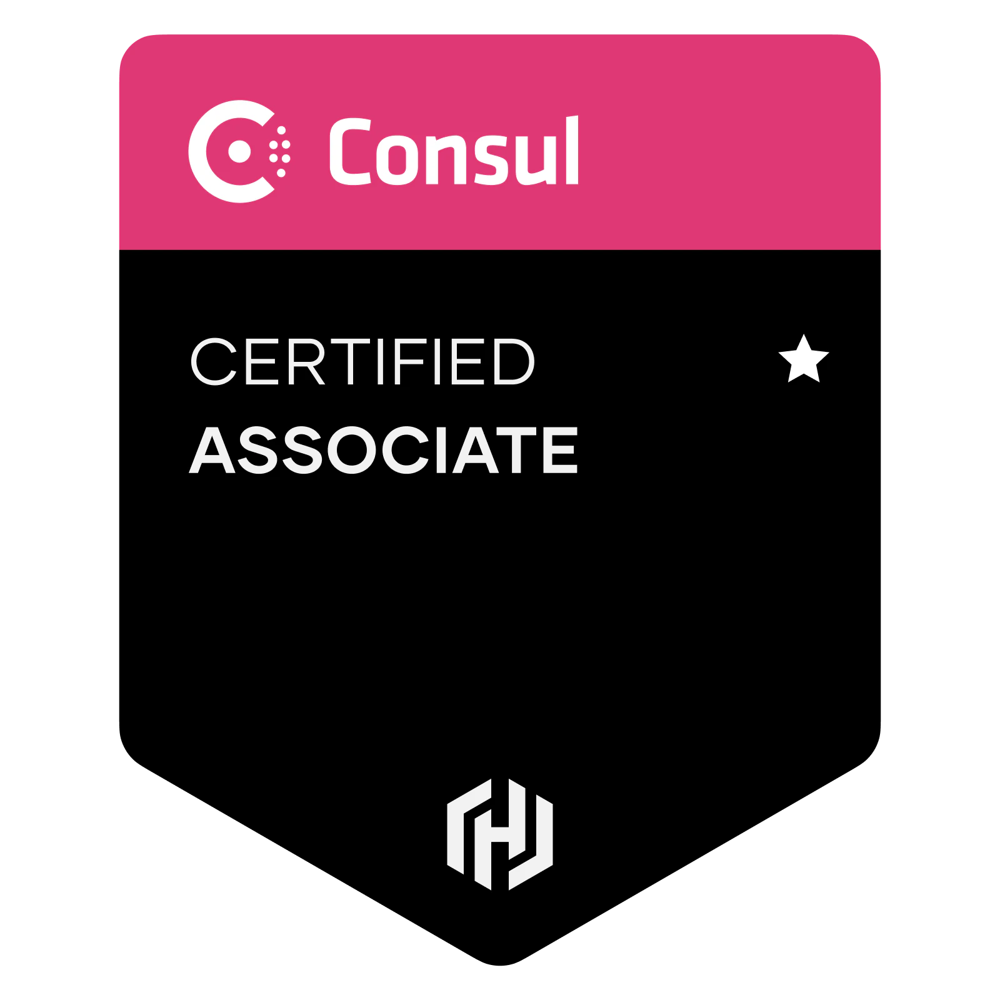

# Consul Associate

## Information

* [Prepare for Consul Certification](https://developer.hashicorp.com/consul/tutorials/certification)
* [Study guide - Consul Associate certification](https://developer.hashicorp.com/consul/tutorials/certification/associate-study)

###

* [Consul Service Tags Modifier](https://github.com/hedzr/consul-tags) - Consul CLI doesn't seem to have way to retreive and modify tags on services.

## Training

* [KodeKloud: HashiCorp Certified: Consul Associate Certification](https://kodekloud.com/courses/hashicorp-certified-consul-associate-certification/) by Bryan Krausen
  * [Lab Notes](consul_associate.labs/README.md)
* [Udemy: HashiCorp Certified: Consul Associate 2024 with Hands-On Labs](https://www.udemy.com/course/hashicorp-consul/)

## Content

These are the certification objectives.

### Explain Consul architecture

* Identify the components of Consul datacenter, including agents and communication protocols
* Prepare Consul for high availability and performance
* Identify Consul's core functionality
* Differentiate agent roles

### Deploy a single datacenter

* Start and manage the Consul process
* Interpret a Consul agent configuration
* Configure Consul network addresses and ports
* Describe and configure agent join and leave behaviors

### Register services and use service discovery

* Interpret a service registration
* Differentiate ways to register a single service
* Interpret a service configuration with health check
* Check the service catalog status from the output of the DNS/API interface or via the Consul UI

### Access the Consul key/value (KV)

* Understand the capabilities and limitations of the KV store
* Interact with the KV store using both the Consul CLI and UI
* Monitor KV changes using watch
* Monitor KV changes using `envconsul` and `consul-template`

### Back up and restore

* Describe the contents of a snapshot
* Back up and restore the datacenter
* [Enterprise] Describe the benefits of snapshot agent features

### Use Consul service mesh

* Understand Consul service mesh high level architecture
* Describe configuration for registering a service proxy
* Describe intentions for Consul service mesh
* Check intentions in both the Consul CLI and UI

### Secure agent communication

* Understanding Consul security/threat model
* Differentiate certificate types needed for TLS encryption
* Understand the different TLS encryption settings for a fully secure datacenter

### Secure services with basic access control lists (ACL)

* Set up and configure a basic ACL system
* Create policies
* Manage token lifecycle: multiple policies, token revoking, ACL roles, service identities
* Perform a CLI request using a token
* Perform an API request using a token

### Use gossip encryption

* Understanding the Consul security/threat model
* Configure gossip encryption for the existing data center
* Manage the lifecycle of encryption keys