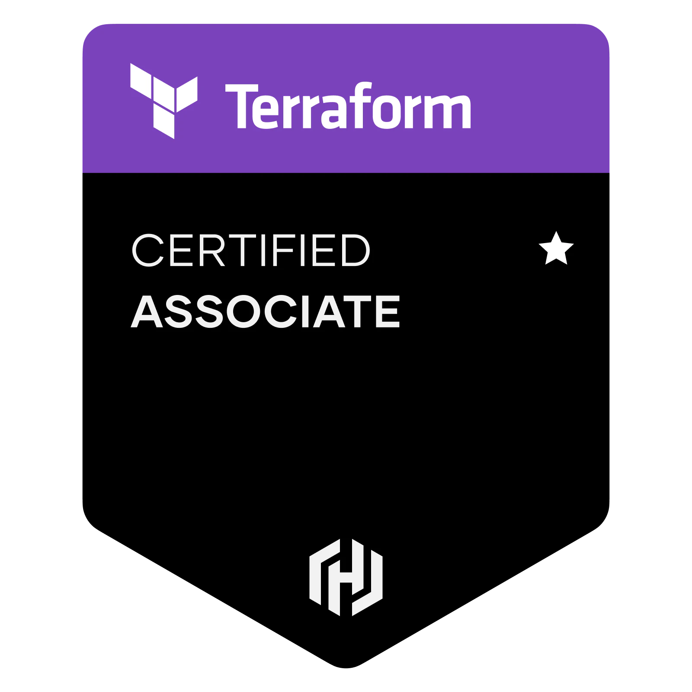

# HashiCorp Certified: Terraform Associate (003)

# Information

* [HashiCorp Certified: Terraform Associate (003)](https://www.hashicorp.com/certification/terraform-associate)

# Content

**Understand infrastructure as code (IaC) concepts**

* Explain what IaC is
* Describe advantages of IaC patterns

**Understand the purpose of Terraform (vs other IaC)**

* Explain multi-cloud and provider-agnostic benefits
* Explain the benefits of state

**Understand Terraform basics**

* Install and version Terraform providers
* Describe plugin-based architecture
* Write Terraform configuration using multiple providers
* Describe how Terraform finds and fetches providers

**Use Terraform outside of core workflow**

* Describe when to use `terraform import` to import existing infrastructure into your Terraform state 
* Use `terraform state` to view Terraform state
* Describe when to enable verbose logging and what the outcome/value is

**Interact with Terraform modules**

* Contrast and use different module source options including the public Terraform Module Registry
* Interact with module inputs and outputs
* Describe variable scope within modules/child modules
* Set module version

**Use the core Terraform workflow**

* Describe Terraform workflow ( Write -> Plan -> Create )
* Initialize a Terraform working directory (`terraform init`)
* Validate a Terraform configuration (`terraform validate`)
* Generate and review an execution plan for Terraform (`terraform plan`)
* Execute changes to infrastructure with Terraform (`terraform apply`)
* Destroy Terraform managed infrastructure (`terraform destroy`)
* Apply formatting and style adjustments to a configuration (`terraform fmt`)

**Implement and maintain state**

* Describe default `local` backend
* Describe state locking
* Handle backend and cloud integration authentication methods
* Differentiate remote state back end options
* Manage resource drift and Terraform state
* Describe `backend` block and cloud integration in configuration
* Understand secret management in state files

**Read, generate, and modify configuration**

* Demonstrate use of variables and outputs
* Describe secure secret injection best practice
* Understand the use of collection and structural types
* Create and differentiate `resource` and `data` configuration
* Use resource addressing and resource parameters to connect resources together
* Use HCL and Terraform functions to write configuration
* Describe built-in dependency management (order of execution based)

**Understand Terraform Cloud capabilities**

* Explain how Terraform Cloud helps to manage infrastructure
* Describe how Terraform Cloud enables collaboration and governance