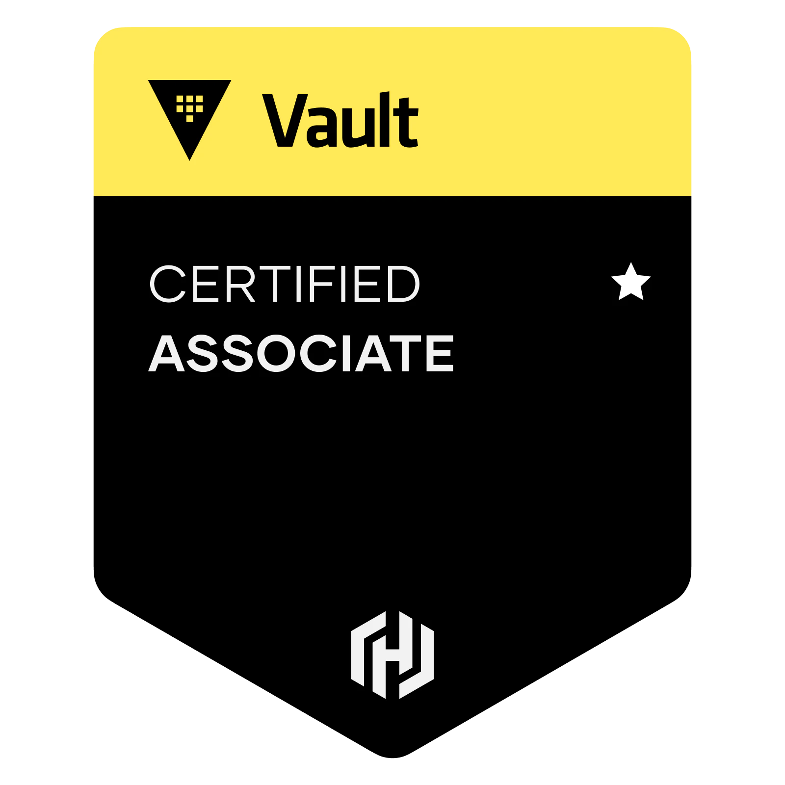

# Vault associate certification

## Information

* [Study guide - Vault associate certification](https://developer.hashicorp.com/vault/tutorials/associate-cert/associate-study)
* [Sample questions - Vault associate certification](https://developer.hashicorp.com/vault/tutorials/associate-cert/associate-questions)
* [Review guide - Vault associate certification](https://developer.hashicorp.com/vault/tutorials/associate-cert/associate-review)

## Content

**Compare authentication methods**

* Describe authentication methods
* Choose an authentication method based on use case
* Differentiate human vs. system auth methods

**Create Vault policies**

* Illustrate the value of Vault policy
* Describe Vault policy syntax: path
* Describe Vault policy syntax: capabilities
* Craft a Vault policy based on requirements

**Assess Vault tokens**

* Assess Vault tokens
* Describe Vault token
* Differentiate between service and batch tokens. 
  Choose one based on use case
* Describe root token uses and lifecycle
* Define token accessors
* Explain time-to-live
* Explain orphaned tokens
* Create tokens based on need

**Manage Vault leases**

* Explain the purpose of a lease ID
* Renew leases
* Revoke leases

**Compare and configure Vault secrets engines**

* Choose a secret method based on use case
* Contrast dynamic secrets vs. static secrets and their use cases
* Define transit engine
* Define secrets engines

**Utilize Vault CLI**

* Authenticate to Vault
* Configure authentication methods
* Configure Vault policies
* Access Vault secrets
* Enable secrets engines
* Configure environment variables

**Utilize Vault UI**

* Authenticate to Vault
* Configure authentication methods
* Configure Vault policies
* Access Vault secrets
* Enable secrets engines

**Be aware of the Vault API**

* Authenticate to Vault via Curl
* Access Vault secrets via Curl

**Explain Vault architecture**

* Describe the encryption of data stored by Vault
* Describe cluster strategy
* Describe storage backends
* Describe the Vault agent
* Describe secrets caching
* Be aware of identities and groups
* Describe Shamir secret sharing and unsealing
* Be aware of replication
* Describe seal/unseal
* Explain response wrapping
* Explain the value of short-lived, dynamically generated secrets

**Explain encryption as a service**

* Configure transit secrets engine
* Encrypt and decrypt secrets
* Rotate the encryption key