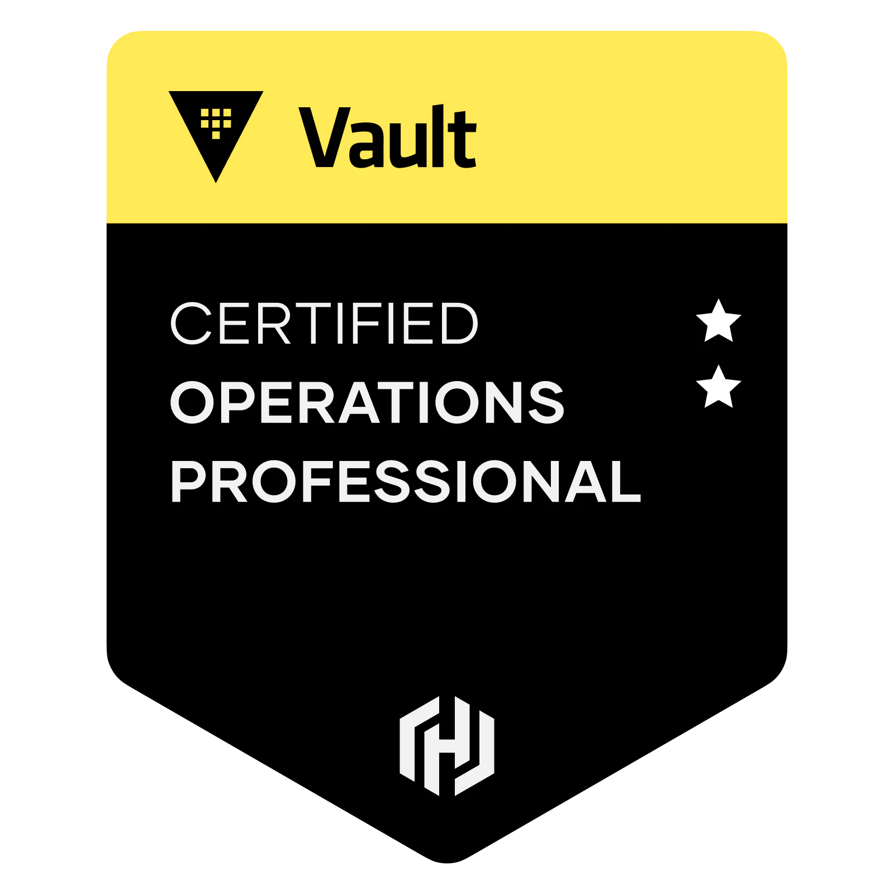

# HashiCorp Certified: Vault Operations Professional

## Information

* [HashiCorp Certified: Vault Operations Professional](https://www.hashicorp.com/certification/vault-operations-professional)
* [Vault operations professional certification overview](https://developer.hashicorp.com/vault/tutorials/ops-pro-cert/ops-pro-overview)
* [Study guide - Vault operations professional certification](https://developer.hashicorp.com/vault/tutorials/ops-pro-cert/ops-pro-study)
* [Review guide - Vault operations professional certification](https://developer.hashicorp.com/vault/tutorials/ops-pro-cert/ops-pro-review)

## Content

**Create a working Vault server configuration given a scenario**

* Enable and configure secret engines
* Practice production hardening
* Auto unseal Vault
* Implement integrated storage for open source and Enterprise Vault
* Enable and configure authentication methods
* Practice secure Vault initialization
* Regenerate a root token
* Rekey Vault and rotate encryption keys

**Monitor a Vault environment**

* Monitor and understand Vault telemetry
* Monitor and understand Vault audit logs
* Monitor and understand Vault operational logs

**Employ the Vault security model**

* Describe secure introduction of Vault clients
* Describe the security implications of running Vault in Kubernetes

**Build fault-tolerant Vault environments**

* Configure a highly available (HA) cluster
* (Vault Enterprise) Enable and configure disaster recovery (DR) replication
* (Vault Enterprise) Promote a secondary cluster

**Understand the hardware security module (HSM) integration**

* (Vault Enterprise) Describe the benefits of auto unsealing with HSM
* (Vault Enterprise) Describe the benefits and use cases of seal wrap (PKCS#11)

**Scale Vault for performance**

* Use batch tokens
* (Vault Enterprise) Describe the use cases of performance standby nodes
* (Vault Enterprise) Enable and configure performance replication
* (Vault Enterprise) Create a paths filter

**Configure access control**

* Interpret Vault identity entities and groups
* Write, deploy, and troubleshoot ACL policies
* (Vault Enterprise) Understand Sentinel policies
* (Vault Enterprise) Define control groups and describe their basic workflow
* (Vault Enterprise) Describe and interpret multi-tenancy with namespaces

**Configure Vault Agent**

* Securely configure auto-auth and token sink
* Configure templating